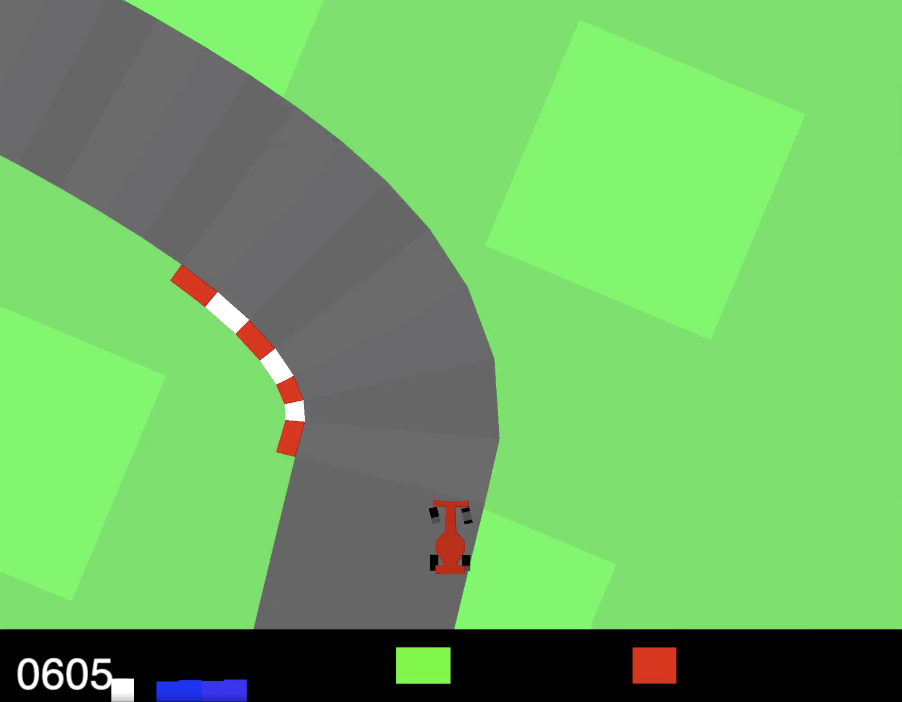

# Reinforcement_Learning_CartRace

We present and evaluate a deep reinforcement learning method on the *CarRacing-v0* environment provided by OpenAI Gym. The difficulty of the game lies in handling very large state and action spaces to learn the optimal policy. Our approach is based on Deep Q-learning in order to approximate the value function, together with a simplification of the action space and state space.

Provided environement : 


#### In order to train/test a model: <br>
In a terminal:
* Place you in the virtual environment :
```js
pipenv shell
pipenv install --skip-lock        
```
* Run the reinforcement learning algorithm:
```js
python3 main.py + --<ARG_NAME> <ARG_VALUE>
```

For example :
```js

python3 main.py --test_name test --n_episode 20 --model_path final_model.pth --evaluate True --render True

```


#### The <ARG_NAME> are:
-  test_name : the name of your test
- n_episode : the number of episodes to be played
- max_horizon : the number of horizon to be explored
- model_path : the path to an already trained model. If None, a new model will be trained/tested
- evaluate : False if you want to train your model
- render : True if you want to display the frame and the car
    
    **ONLY FOR TRAINING:**
- num_frame_stack : number of images in input for the network
- gamma : use in Bellman's update equation
- eps, eps_decay, eps_end : for e-greed policy
- learning_rate 
- tau : to update the estimate network
- batch_size : number of batch when the network is updated


